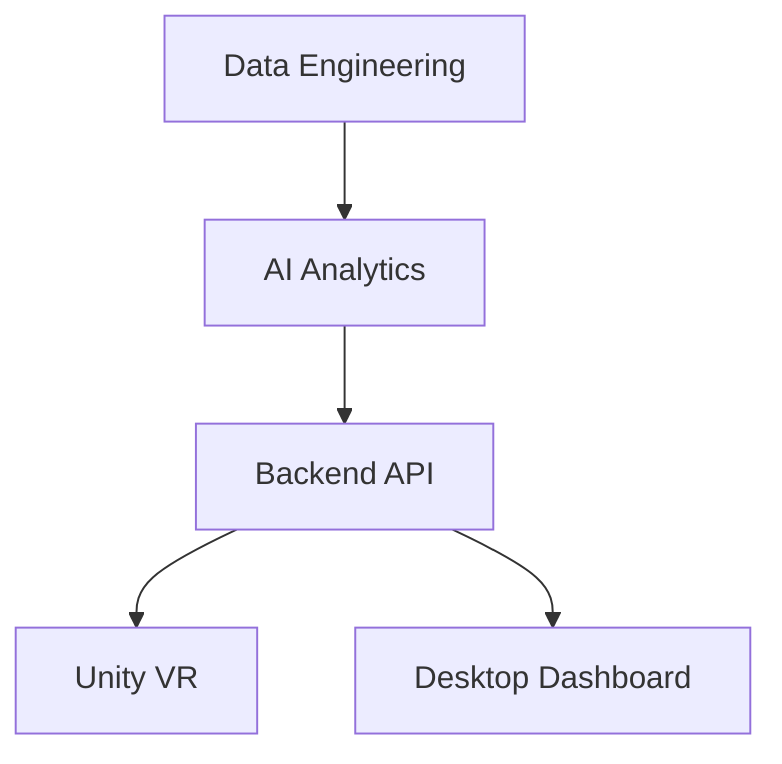

# Data Dive – Immersive Analytics pour Graphes Massifs

**Plateforme de visualisation immersive dédiée à l'analyse de graphes financiers massifs pour la détection de fraude.**

---

## Description

Data Dive combine plusieurs technologies pour offrir une expérience d'analyse puissante et immersive :

- **Data Engineering** pour le traitement et la préparation des données
- **Intelligence Artificielle** pour le clustering et la détection d'anomalies
- **Backend API** avec FastAPI
- **Visualisation VR** avec Unity et Meta Quest
- **Dashboard Desktop** pour l'analyse en temps réel

---

## Technologies Utilisées

| Domaine              | Technologie                          |
|----------------------|--------------------------------------|
| Data Engineering     | Python, Pandas, NumPy                |
| Machine Learning     | Scikit-Learn, HDBSCAN                |
| Backend              | FastAPI                              |
| VR                   | Unity, Meta XR SDK                   |
| Dashboard            | Streamlit                            |
| Dataset              | PaySim Dataset                       |

---

## Architecture du Projet


---
## Structure du Dépôt

```bash
data_dive_project/
├── phase1_data_engineering/
├── phase2_ai_analytics/
├── phase3_backend_api/
├── phase4_unity_vr/
├── phase5_desktop_client/
└── README.md
```
---

## Prérequis

| Logiciel           | Version recommandée         | Utilité                          |
|--------------------|-----------------------------|----------------------------------|
| **Python**         | 3.10+                       | Phases 1, 2, 3 et 5              |
| **Unity**          | 2022.3 LTS ou Unity 6       | Phase 4                          |
| **Meta Quest Link**| Dernière version            | Connexion casque VR              |
| **Git**            | Dernière version            | Gestion du projet                |
---
## Installation Rapide

### 1. Cloner le dépôt
```bash
git clone https://github.com/votre-repo/data_dive_project.git
cd data_dive_project
```
### 2. Installer les dépendances
```bash
# Phase 1 - Data Engineering
pip install -r phase1_data_engineering/requirements.txt

# Phase 2 - AI Analytics
pip install -r phase2_ai_analytics/requirements.txt

# Phase 3 - Backend API
pip install -r phase3_backend_api/requirements.txt

# Phase 5 - Dashboard
pip install -r phase5_desktop_client/requirements.txt
```
### 3. Lancer le Backend
```bash
cd phase3_backend_api
python -m uvicorn app.main:app --host 127.0.0.1 --port 8010 --reload
```
Accès :
-API → http://127.0.0.1:8010
-Swagger → http://127.0.0.1:8010/docs

### 4. Lancer Unity VR

1. Ouvrir Unity Hub
2. Ajouter le dossier phase4_unity_vr
3. Ouvrir la scène : Assets/Scenes/MainScene.unity
4. Cliquer sur ▶ Play

### 5. Lancer le Dashboard
```bash
cd phase5_desktop_client
python -m streamlit run app/dashboard.py
```
## Jeu de Données

**Dataset complet :** [PaySim](https://www.kaggle.com/datasets/ealaxi/paysim1)

### Instructions d'installation des données

1. Télécharger le fichier `paysim.csv`
2. Le placer dans le dossier suivant :
   ```bash
   phase1_data_engineering/data/raw/paysim.csv
   ```
3. Exécuter les scripts de traitement :
   ```bach
   # Phase 1 - Data Engineering
   python phase1_data_engineering/src/main.py
   # Phase 2 - AI Analytics
   python phase2_ai_analytics/src/main.py
   ```
---
## Fonctionnalités

- **Phase 1** : Nettoyage, transformation et génération de graphes
- **Phase 2** : Clustering (HDBSCAN) + Détection d'anomalies (Isolation Forest)
- **Phase 3** : API REST FastAPI
- **Phase 4** : Visualisation 3D immersive en VR (Meta Quest)
- **Phase 5** : Dashboard analytique interactif avec Streamlit

---
## Démonstration
### Vidéo
[ https://drive.google.com/drive/folders/1xMk1WZep_7o-21d74oNec-ukBYJafCWF?usp=drive_link ]
## Équipe
- Amar Chaimaa 
- Assmaa Azaroual 
- Bensaid Malak
- Basma El mghari
- Mohamed Smaoui
  
